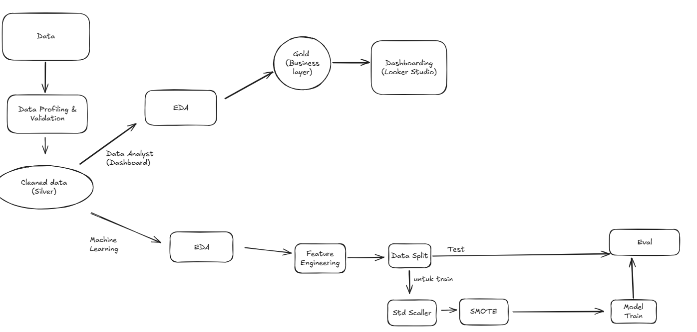

# 🏦 Bank Customer Churn Analysis & Prediction

An end-to-end Data Analytics and Machine Learning project that analyzes customer churn behavior and predicts customers who are likely to leave a bank.

The project covers the complete analytics pipeline, from data preprocessing and exploratory analysis to dashboard development and predictive modeling.

---

## 📌 Project Overview

This project aims to:

- Analyze customer churn behavior using Business Analytics.
- Build an interactive dashboard for business insights.
- Develop machine learning models to predict customer churn.

---

## 📂 Repository Structure

```
.
├── data/
│   ├── bronze/
│   ├── silver/
│   └── gold/
│
├── data-preprocessing.ipynb
├── business-analytics.ipynb
├── churn-prediction.ipynb
├── Customer Churn Analytical Dashboard.png
├── README.md
└── .gitignore
```

---

## 🔄 Project Workflow

```

```

---

## 🛠️ Technologies

- Python
- Pandas
- NumPy
- Matplotlib
- Seaborn
- Scikit-Learn
- XGBoost
- Imbalanced-Learn (SMOTE)
- Looker Studio

---

### BA Dashboard

(https://datastudio.google.com/reporting/e4d5658f-16e7-48f2-b7ee-75a632208d54)

---

## 🤖 Machine Learning

Two ensemble learning algorithms were developed and compared.

### Models

- Random Forest
- XGBoost


## 📈 Model Performance

| Model | Accuracy | F1 Score |
|--------|----------|----------|
| Baseline Random Forest | **0.8695** | 0.5991 |
| Best Random Forest | 0.8580 | 0.6312 |
| Best XGBoost | 0.8545 | **0.6403** |

Although the baseline Random Forest achieved the highest accuracy, the tuned XGBoost model produced the highest F1 Score, making it the preferred model for customer churn prediction.

---


## 📁 Dataset

The dataset contains information from **10,000 bank customers**, including:

- Credit Score
- Geography
- Gender
- Age
- Balance
- Number of Products
- Card Type
- Customer Activity
- Satisfaction Score
- Estimated Salary
- Churn Status

---
